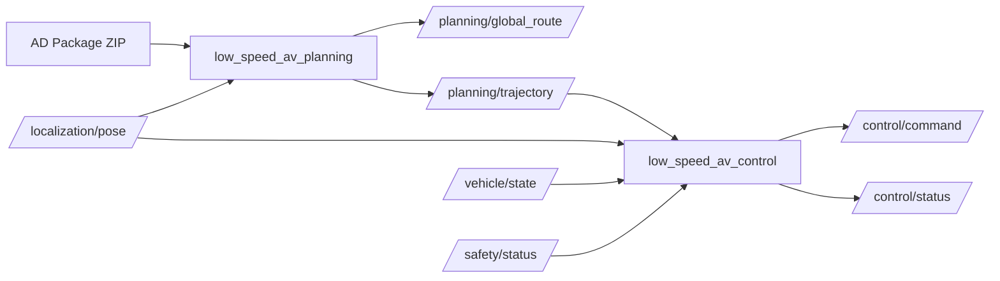

# 02 Target ROS2 Architecture

## Package Diagram



## Modules

### low_speed_av_interfaces

ROS2 interface definitions only.

### low_speed_av_planning

Responsibilities:

1. Load and validate AD Package.
2. Parse topology graph.
3. Parse waypoints and index.
4. Resolve mission goals from nodes/task/parking/charging points.
5. Run Dijkstra or A*.
6. Stitch trajectory from edge sequence.
7. Run speed planner.
8. Publish global route and trajectory.

### low_speed_av_control

Responsibilities:

1. Subscribe configurable localization topic, default `/localization/pose`.
2. Subscribe `/planning/trajectory`.
3. Subscribe `/vehicle/state` and `/safety/status` if available.
4. Run selected control algorithm.
5. Convert curvature/steer through selected Ackermann model.
6. Apply limits and smoother.
7. Publish `/control/command`.

### low_speed_av_bringup

Responsibilities:

- Default launch files.
- Config YAML.
- Sample AD Package location.
- Offline validation scripts.

## Data Flow

```text
AD Package ZIP / directory
  -> RoadnetLoader
  -> RoadnetMap object
  -> GlobalPlanner
  -> GlobalRoute msg
  -> MotionPlanner + SpeedPlanner
  -> Trajectory msg
  -> Controller
  -> ControlCommand msg
```

## Runtime Modes

```yaml
planning:
  mode: "normal"        # normal | replay | static_demo
control:
  mode: "closed_loop"   # closed_loop | offline_demo | command_hold
```

In `static_demo`, planning can use `examples/mission.example.json` from the AD Package. In normal mode, mission should be received through a service/action or task manager topic.
