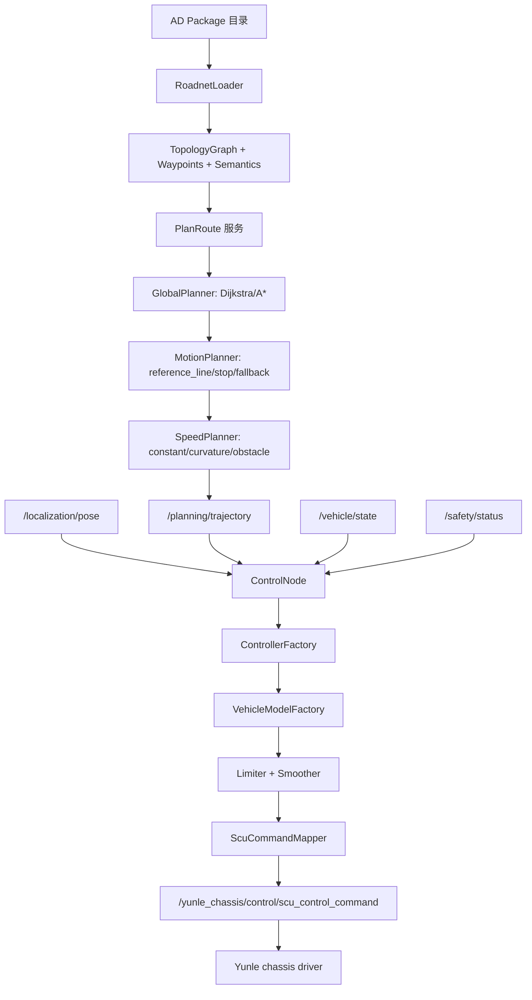

# 技术路线与数据流

本文描述当前工程从 AD Package 到 Yunle SCU 底盘命令的完整数据流。

## 1. 总体技术路线

```text
AD Package ZIP/dir
  -> RoadnetLoader
  -> topology graph + waypoints + semantics
  -> PlanRoute service
  -> GlobalRoute
  -> Trajectory
  -> ControlNode
  -> Controller algorithm
  -> Ackermann vehicle model
  -> Command limiter/smoother
  -> ScuCommandMapper
  -> /yunle_chassis/control/scu_control_command
  -> chassis driver
  -> CAN SCU_Control_Command 0x121
```

当前工程消费解压后的 AD Package 目录；如果来自 ZIP，需要先解压到目录。

## 2. 数据流阶段

### 2.1 AD Package 到 RoadnetPackage

输入：

- `roadnet.package_path`
- `project_manifest.json`
- `roadnet/topology.json`
- `trajectory/waypoints.yaml`
- `trajectory/waypoint_index.json`
- `semantics/*.json`
- `validation/validation_report.json`
- `checksums.sha256`

输出：

- 内部 `RoadnetPackage`
- `nodes`
- `edges`
- `waypoints`
- `waypoint_index_by_edge`
- `areas`
- `task_points`
- `parking_points`
- `charging_points`
- `blocked_edges`

证据：`src/low_speed_av_planning/include/low_speed_av_planning/roadnet_types.hpp`。

### 2.2 RoadnetPackage 到 GlobalRoute

触发：

```text
/low_speed_av_planning/plan_route
```

输入：

- `start_node_id` 或 `start_task_point_id`
- `goal_node_id` 或 `goal_task_point_id` 或 `goal_parking_point_id`
- 当前 global planner algorithm
- blocked edges
- allow reverse

输出：

- response `GlobalRoute route`
- topic `/planning/global_route`

### 2.3 GlobalRoute 到 Trajectory

输入：

- route edge_ids
- waypoint index
- waypoints
- motion planner options
- speed planner options
- semantic speed-zone

输出：

- `/planning/trajectory`

轨迹点字段：

- `x_m`
- `y_m`
- `yaw_rad`
- `kappa_1pm`
- `s_m`
- `v_mps`
- `gear`

### 2.4 Trajectory + Pose 到 ControlCommand

输入：

- `/localization/pose`
- `/planning/trajectory`
- `/vehicle/state`
- `/safety/status`
- 控制器配置
- 车辆模型配置

输出：

- 内部 `ControlCommand`
- 可选 `/control/command`
- 默认 `/yunle_chassis/control/scu_control_command`

### 2.5 ControlCommand 到 SCU

内部保持 SI 单位：

- speed：m/s
- steering：rad
- curvature：1/m

最终 SCU 输出：

- speed：km/h，非负
- steering：deg
- gear：D/N/R
- brake：bool

## 3. Topic 和 Service 表

| 生产者 | Topic/Service | 类型 | 消费者 | 使用时机 |
|---|---|---|---|---|
| planning node | `/low_speed_av_planning/reload_roadnet` | `low_speed_av_interfaces/srv/ReloadRoadnet` | 操作员/上层任务 | 启动后或换图时加载 AD Package |
| planning node | `/low_speed_av_planning/set_planner_algorithm` | `low_speed_av_interfaces/srv/SetPlannerAlgorithm` | 操作员/上层任务 | 切换 global/motion/speed 算法 |
| planning node | `/low_speed_av_planning/plan_route` | `low_speed_av_interfaces/srv/PlanRoute` | 操作员/任务系统 | 触发路线规划 |
| planning node | `/planning/global_route` | `low_speed_av_interfaces/msg/GlobalRoute` | 监控/调试 | PlanRoute 成功或失败时发布 |
| planning node | `/planning/trajectory` | `low_speed_av_interfaces/msg/Trajectory` | control node | 控制参考轨迹 |
| planning node | `/planning/status` | `low_speed_av_interfaces/msg/ModuleStatus` | 监控/操作员 | 规划状态 |
| planning node | `/planning/roadnet_status` | `low_speed_av_interfaces/msg/RoadnetStatus` | 监控/操作员 | AD Package 加载状态 |
| localization | `/localization/pose` | `geometry_msgs/msg/PoseStamped` | control node | 控制周期必须输入 |
| vehicle/chassis state | `/vehicle/state` | `low_speed_av_interfaces/msg/VehicleState` | control node | 提供车速、挡位、当前转角 |
| safety module | `/safety/status` | `low_speed_av_interfaces/msg/ModuleStatus` | control node | Estop/failure 优先级最高 |
| control node | `/low_speed_av_control/set_controller_algorithm` | `low_speed_av_interfaces/srv/SetControllerAlgorithm` | 操作员/上层任务 | 切换 controller 和 vehicle model |
| control node | `/control/command` | `low_speed_av_interfaces/msg/ControlCommand` | 调试/兼容 | `output.mode=internal/both` |
| control node | `/control/status` | `low_speed_av_interfaces/msg/ModuleStatus` | 监控/操作员 | 控制状态 |
| control node | `/yunle_chassis/control/scu_control_command` | `chassis_interfaces/msg/ScuControlCommand` | Yunle chassis driver | 最终底盘控制 |

## 4. 时序假设

```text
1. 启动 bringup。
2. planning node 加载 roadnet.package_path；若为空，等待 ReloadRoadnet。
3. 操作员或任务系统调用 PlanRoute。
4. planning node 发布 GlobalRoute 和 Trajectory。
5. control node 已经周期运行；收到 pose 和 trajectory 后开始正常 tracking。
6. 若 estop、定位超时、轨迹超时或空轨迹出现，control node 输出 brake stop。
7. 正常控制命令经 SCU mapper 发布到底盘 topic。
```

## 5. 优先级

控制输出优先级从高到低：

1. `/safety/status` estop/failure。
2. 定位缺失或超时。
3. 轨迹缺失、超时或空轨迹。
4. 控制器输出 NaN/Inf。
5. 正常 tracking command。

规划输出优先级：

1. AD Package 加载失败时不可规划。
2. 起终点无法解析时失败。
3. no-go/keepout 或 blocked edge 导致不可达时失败。
4. motion planner 轨迹为空时失败。
5. 成功时发布 route + trajectory。

## 6. Mermaid 数据流


